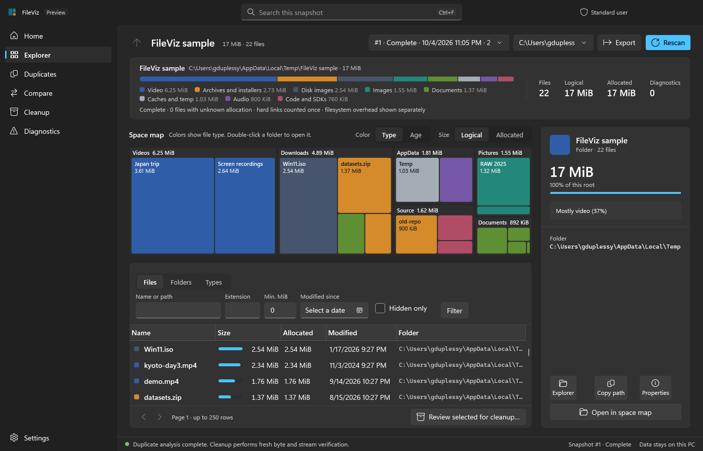

<p align="center">
  <picture>
    <source media="(prefers-color-scheme: dark)" srcset="docs/images/readme-banner-dark.svg">
    <source media="(prefers-color-scheme: light)" srcset="docs/images/readme-banner-light.svg">
    
  </picture>
</p>

<p align="center">
  <a href="https://github.com/gduplessy/fileviz/releases"></a>
  <a href="https://github.com/gduplessy/fileviz/actions/workflows/ci.yml"></a>
  <a href="docs/setup.md"></a>
  <a href="global.json"></a>
  <a href="LICENSE"></a>
</p>

<p align="center">
  <strong>Find large files. Understand each drive. Review duplicates before cleanup.</strong><br>
  A native Windows desktop app built with C#, WPF, and SQLite. Your scan data stays on your PC.
</p>

<p align="center">
  <a href="#download">Download</a> ·
  <a href="#see-it-in-action">Screenshots</a> ·
  <a href="docs/user-guide.md">User guide</a> ·
  <a href="docs/performance.md">Benchmarks</a> ·
  <a href="CONTRIBUTING.md">Contribute</a>
</p>

> [!IMPORTANT]
> **Preview software.** Raw NTFS fixture parity passes, but the 2× MFT speed target is not yet met. Combined UI/worker memory on real million-file volumes and the full provider matrix remain unverified. Read the [performance report](docs/performance.md) and [validation matrix](docs/validation.md).

## Download

<p>
  <a href="https://github.com/gduplessy/fileviz/releases/download/v0.1.1/FileViz-0.1.1-win-x64-setup.exe"></a>
  <a href="https://github.com/gduplessy/fileviz/releases/download/v0.1.1/FileViz-0.1.1-win-x64-portable.zip"></a>
</p>

| Package | Choose it when | How to run |
| --- | --- | --- |
| **Per-user installer** | You want Start menu integration and an uninstaller. | Run the setup executable. No administrator access is needed to install. |
| **Portable ZIP** | You want to extract and run without installing. | Extract the **entire** archive, then launch `FileViz.exe`. Keep its `worker` folder beside it. |

Both packages bundle the Windows x64 runtime; you do not need to install .NET. [All releases](https://github.com/gduplessy/fileviz/releases) · [v0.1.1 SHA-256 checksums](https://github.com/gduplessy/fileviz/releases/download/v0.1.1/SHA256SUMS.txt)

> [!NOTE]
> Packages are currently unsigned. Windows SmartScreen may prompt before launch. Verify the checksum against the file attached to the same release.

## See it in action

<picture>
  <source media="(prefers-color-scheme: dark)" srcset="docs/images/desktop-dark.png">
  <source media="(prefers-color-scheme: light)" srcset="docs/images/desktop.png">
  
</picture>

*Actual desktop, disposable sample data. The screenshot follows your GitHub color theme.*

<details>
<summary><strong>Compare the light and dark themes</strong></summary>

| Light | Dark |
| --- | --- |
|  |  |

</details>

## What you can do

| Explore your storage | Find duplicates | Review cleanup |
| --- | --- | --- |
| Drive capacity and used/free space | Case-insensitive name candidates | Exact selected-path review |
| Largest files and folders | SHA-256 by default; SHA-1 or MD5 options | Fresh identity, byte, and alternate-stream checks |
| Interactive treemap and file-type breakdown | Size → sample → full-hash pipeline | Same-volume quarantine with an action journal |
| Logical and reported allocated sizes | Hard links shown as aliases | Restore without overwriting destinations |
| Filters, exclusions, saved profiles | Preferred-folder keeper suggestions | Explicit Windows Recycle Bin requests |

- **Scan your scope:** one drive, selected folders, multiple roots, or UNC shares. Hidden/system entries are included; reparse children and cloud placeholders are skipped.
- **Elevate when needed:** request UAC for a read-only scan worker, or restart the whole application as administrator. Complete supported local NTFS volumes can use the raw MFT engine; structural failures discard raw results and visibly fall back to directory enumeration.
- **Keep useful history:** reopen SQLite snapshots, compare changes, export CSV/JSON, and inspect coverage gaps. Partial, cancelled, and stale results remain labelled.
- **Stay in control:** pause at safe batch boundaries, cancel workers, use keyboard navigation, or open selected entries in Explorer and inspect properties.

> [!TIP]
> Start with a drive or folder scan, inspect the largest files, then run content duplicate analysis only where needed. Hashing reads file contents and adds I/O.

> [!WARNING]
> Name matches and sampled content never establish duplicate equivalence. Quarantine retains disk space; Recycle Bin operations do not immediately reclaim it. Cleanup requires explicit review, and duplicate removal requires fresh byte/stream verification with a surviving keeper.

## Measured performance

| Synthetic SQLite dataset | Peak index-process working set | Cached file query median / max |
| --- | --- | --- |
| 1 million files, interleaved | 180.60 MiB | 1.12 / 14.70 ms |
| 10 million files, directory-clustered | 192.59 MiB | 5.76 / 86.67 ms |

These measure the **index component**, not live filesystem throughput or combined UI/worker memory. Dataset orders differ and are not direct scaling comparisons. The raw engine was slower on the small warm NTFS fixture. [Hardware, timings, unmet targets, and reproduction commands](docs/performance.md) · [Machine-readable evidence](docs/evidence/)

## Build from source

<details>
<summary><strong>Windows development setup</strong></summary>

Use the .NET SDK pinned in `global.json`. The bootstrap installs it under ignored `.tools/dotnet`; the wrapper selects it even when the global command resolves to .NET 6.

```powershell
./scripts/bootstrap.ps1
./scripts/dotnet.ps1 restore FileViz.slnx --locked-mode
./scripts/dotnet.ps1 build FileViz.slnx -c Release --no-restore
./scripts/dotnet.ps1 test FileViz.slnx -c Release --no-build
./scripts/run.ps1
```

See [setup](docs/setup.md), [architecture](docs/architecture.md), and the [release process](docs/release.md). Parser and cleanup changes require disposable fixtures and relevant correctness tests.

</details>

## Documentation and community

| Use FileViz | Work on FileViz |
| --- | --- |
| [User guide](docs/user-guide.md) | [Development setup](docs/setup.md) |
| [Performance report](docs/performance.md) | [Architecture](docs/architecture.md) |
| [Validation coverage](docs/validation.md) | [Contributing](CONTRIBUTING.md) |
| [Changelog](CHANGELOG.md) | [Design system and roadmap](docs/design.md) |
| | [Report a bug](https://github.com/gduplessy/fileviz/issues/new) |
| [Release downloads](https://github.com/gduplessy/fileviz/releases) | [Report a security issue privately](SECURITY.md) |

**Local by default:** snapshots and journals live in `%LOCALAPPDATA%/FileViz`. No telemetry, automatic deletion, hard-link replacement, automatic updates, drivers, or remote storage. Scanning and hashing do not modify files.

**GPL-3.0-only:** see [LICENSE](LICENSE). Full dependency licenses and [third-party notices](THIRD-PARTY-NOTICES.md) ship with both packages. The README banners are original SVG artwork included in this repository.
